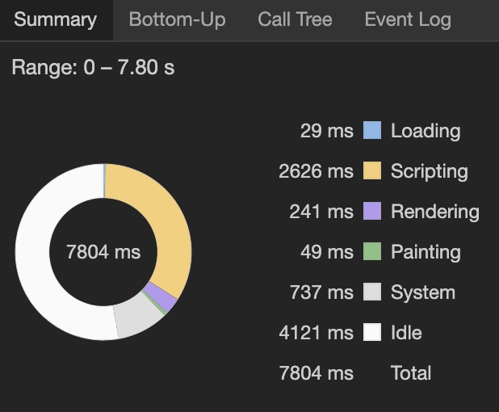
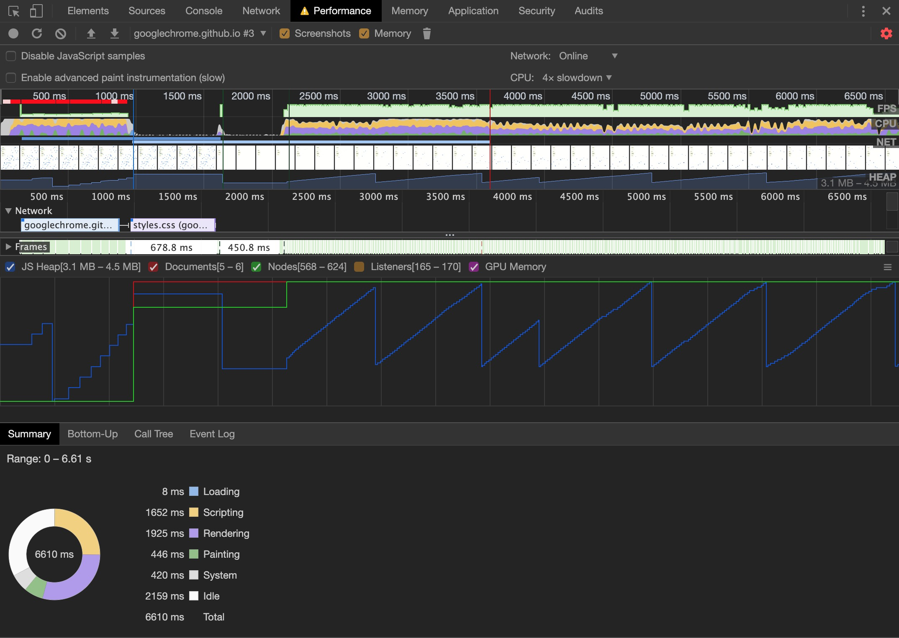
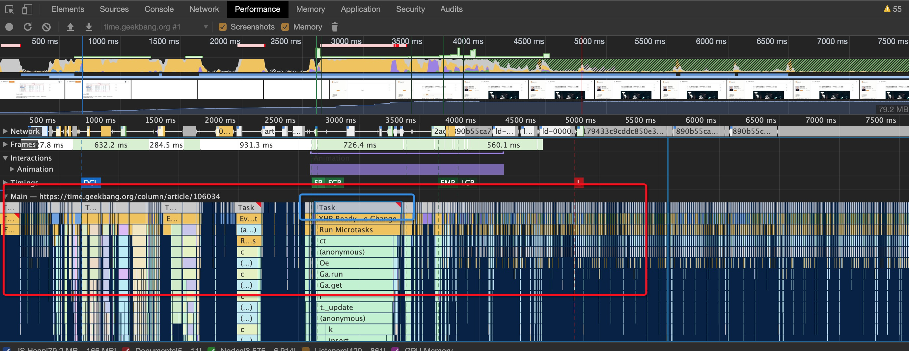
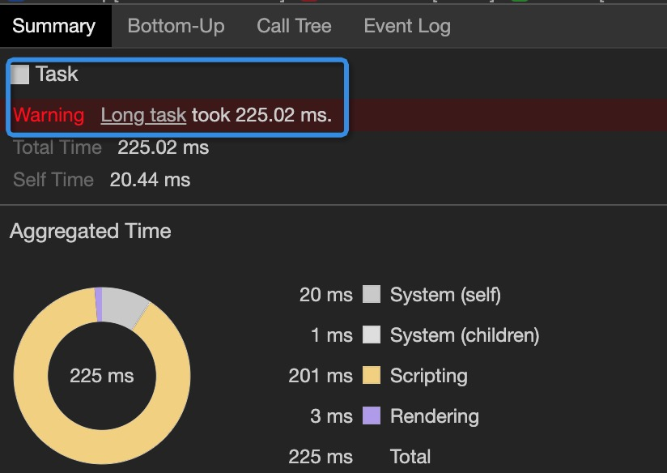

#### 性能分析(参考：https://zhuanlan.zhihu.com/p/29879682)
https://developers.google.com/web/fundamentals/performance/why-performance-matters

* 接下来以该demo为例来分析性能：https://googlechrome.github.io/devtools-samples/jank/
* 模拟移动端CPU性能：点击Capture Settings（⚙️）按钮，选择2x slowdown，于是Devtools就开始模拟两倍低速CPU。
* 在DevTools中点击Record开始录制各项性能指标。
* 
* 
* 分析：
  * 在事件长条的右上角处，如果出现了红色小三角，说明这个事件是存在问题的，需要特别注意
  * 
  * 