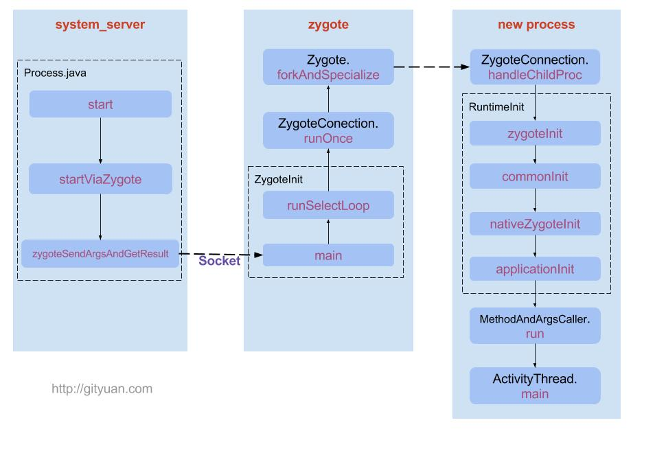

#### 启动流程
* App发起进程：从桌面启动应用，则发起的进程即为Launcher所在的进程。从某App应用内启动远程的进程，则发送的进程即为该App所在的进程。发送进程先通过binder发送消息给system_server进程。
* system_server进程：调用Process.Start()方法，通过socket向Zygote进程发送创建新进程的请求。
* zygote进程：在执行ZygoteInit.main()后便进入runSelectLoop()循环体内，当有客户端连接时便会执行ZygoteConnection.runOnce()方法，再经过层层调用后fork出新的应用进程
* 新进程：执行handleChildProc方法，最后调用ActivityThread.main()方法
* 
* 进程创建的流程图如下：
* 

##### 线程启动


#### Activity启动流程

#### Activity启动时序图


#### LaunchMode
> standard是Activity默认的启动模式，在不进行显式指定的情况下，所有活动都会自动使用这种启动模式。
> 每次都会启动一个新的Activity放到栈顶
> android:launchMode="standard",此时每次点击按钮都会创建新的Activity实例

代码示例：

点击三次，输出的都是不同的Activity实例：


> singleTop:当Activity的启动模式是singleTop时，如果要启动的Activity已经处于栈顶，则直接使用，不会再创建新的实例（核心是位于栈顶才会被复用）会回调onNewIntent方法
> android:launchMode="singleTop"

代码示例：

点击MainActivity的button1，点击多次日志也只会打出一条，也就是说在singleTop启动模式下，由于要启动的MainActivity实例已经在栈顶，所以不会重新创建，只会存在一个实例，表现上也不会出现standard模式下的跳转；点击MainActivity的button2，会跳转到FirstActivity，这时会创建FirstActivity实例并入栈，这时候继续点击FirstActivity的按钮button，会重新创建MainActivity实例，因为此时栈顶已经是FirstActivity了。


分析：singleTop适用的场景，通常比较适用于接收到消息后显示的界面。比如qq接收消息弹出Activity消息界面，需要用一个activity实例来展示。还有新闻消息的推送之类的。


> singleTask:当活动的启动模式为singleTask时，启动该Activity会现在栈中检查是否已存在，若存在则直接将该活动之上的Activity全部出栈。（跟singleTop比较相似，但是这个是用于检测整个栈里是否已经存在要启动的Activity），也会回调onNewIntent方法
> android:launchMode="singleTask"(设置MainActivity启动模式为singleTask)

代码示例：


输出：


查看栈信息：
adb shell dumpsys activity activities

```Java
Activities=[ActivityRecord{d6e9fc6 u0 com.randy.launchapp/.MainActivity t4568}]
```
发现从SecondActivity跳转到MainActivity之后，Activity栈中只存在MainActivity实例了，FirstActivity和SecondActivity都被从栈里移除了。


分析：singleTask 模式比较适合应用的主界面activity

> singleInstance:在singleInstance模式下，该Activity在整个android系统内存中有且只有一个实例，而且该实例单独尊享一个Task。换句话说，A应用需要启动的MainActivity 是singleInstance模式，当A启动后，系统会为它创建一个新的任务栈，然后A单独在这个新的任务栈中，如果此时B应用也要激活MainActivity，由于栈内复用的特性，则不会重新创建，而是两个应用共享一个Activity的实例

* 启动方式的设置
  * 通过AndroidMenifest.xml文件为Activity指定启动模式
  * 通过在Intent中设置标志位(addFlags方法)来为Activity指定启动模式

```java
Intent intent = new Intent();
intent.setClass(ActivityB.this,ActivityA.class);
intent.addFlags(Intent.FLAG_ACTIVITY_NEW_TASK);
startActivity(intent);
```

  * Intent.FLAG_ACTIVITY_NEW_TASK -- singleTask
  * Intent.FLAG_ACTIVITY_SINGLE_TOP -- singleTop
  * Intent.FLAG_ACTIVITY_CLEAR_TOP  -- singleTask
  * Intent.FLAG_ACTIVITY_NO_HISTORY  --  使用该模式来启动Activity，当该Activity启动其他Activity后，该Activity就被销毁了，不会保留在任务栈中。如A-B,B中以这种模式启动C，C再启动D，则任务栈只有ABD
  * Intent.FLAG_ACTIVITY_EXCLUDE_FROM_RECENTS  -- 使用该标识位启动的Activity不添加到最近应用列表，也即我们从最近应用里面查看不到我们启动的这个activity。与属性android:excludeFromRecents="true"效果相同

https://blog.csdn.net/javazejian/article/details/52072131


* Activity的生命周期
* https://developer.android.com/guide/components/activities/activity-lifecycle
* 