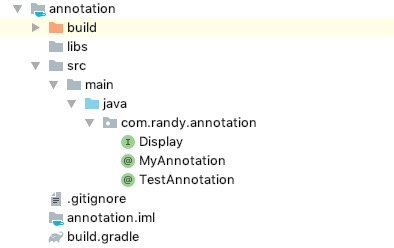
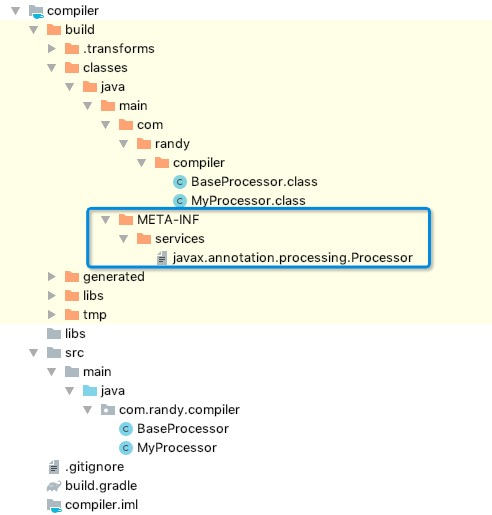
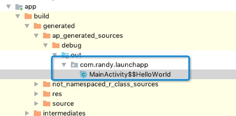

#### SPI
##### JavaPoet
> Java/Android框架经常会使用编译期注解，其中的关键一步就是如何生成Java文件。JavaPoet是用来生成java代码的一个Java Library。

* 核心的几个类：
  * JavaFile 对应的Java文件，包名直接用一个字符串表示。
  * TypeSpec 表示一个class定义。
  * FieldSpec 表示类中的属性。
  * MethodSpec 表示类中的方法。
  * JavaPoet专门定义了如下几种专门描述类型的类：

| 分类                   | 生成的类型       | JavaPoet写法                                        | 等效的java写法 |
| ---------------------- | ---------------- | --------------------------------------------------- | -------------- |
| 内置类型               | int              | TypeName.INT                                        |
| 数组类型               | int[]            | ArrayTypeName.of(int.class)                         |
| 需要引入包名的类型     | java.io.File     | ClassName.get("java.io", “File”)                    |
| 参数化类型             | List             | ParameterizedTypeName.get(List.class, String.class) |
| 类型变量，用于声明泛型 | T                | TypeVariableName.get("T")                           |
| 通配符类型             | ? extends String | WildcardTypeName.subtypeOf(String.class)            |

这些类型之间可以相互嵌套，比如 ParameterizedTypeName.get(List.class, String.class) 其中 List.class 等价于 ClassName.get("java.util", "List")。 因此，
ParameterizedTypeName.get(List.class, String.class)
可以写为
ParameterizedTypeName.get(ClassName.get("java.util", "List"), ClassName.get("java.lang", "String"))。

注：前者的好处是简洁，后者的好处是"使用 ClassName 代表某个类型而无需引入该类型"。比如： 由于在 java 工程中是没有 android 的 sdk， 所以你在 java 工程中想生成 android.app.Activity 这种类型是不能直接 Activity.class。这种情况下只能通过 ClassName 进行引用。”

* Statement中的占位符
  ```
  $T 是类型替换, 一般用于 ("$T foo", List.class) => List foo. $T 的好处在于 JavaPoet 会自动帮你补全文件开头的 import. 如果直接写 ("List foo") 虽然也能生成 List foo， 但是最终的 java 文件就不会自动帮你添加 import java.util.List.

  $L 是字面量替换, 比如 ("abc$L123", "FOO") => abcFOO123. 也就是直接替换.

  $S 是字符串替换, 比如: ("$S.length()", "foo") => "foo".length() 注意 $S 是将参数替换为了一个带双引号的字符串. 免去了手写 "\"foo\".length()" 中转义 (\") 的麻烦.

  $N 是名称替换, 比如你之前定义了一个函数 MethodSpec methodSpec = MethodSpec.methodBuilder("foo").build(); 现在你可以通过 $N 获取这个函数的名称 ("$N", methodSpec) => foo.
  ```
  
```java
MethodSpec main = MethodSpec.methodBuilder("main")
    .addModifiers(Modifier.PUBLIC, Modifier.STATIC)
    .returns(void.class)
    .addParameter(String[].class, "args")
    .addStatement("$T.out.println($S)", System.class, "Hello, JavaPoet!")
    .build();

TypeSpec helloWorld = TypeSpec.classBuilder("HelloWorld")
    .addModifiers(Modifier.PUBLIC, Modifier.FINAL)
    .addMethod(main)
    .build();

JavaFile javaFile = JavaFile.builder("com.example.helloworld", helloWorld)
    .build();

javaFile.writeTo(System.out);
```
* 采用javapoet 执行上述代码可以生成如下的代码：
```java
package com.example.helloworld;

public final class HelloWorld {
  public static void main(String[] args) {
    System.out.println("Hello, JavaPoet!");
  }
}
```
* 代码逻辑转换
```java
void main() {
  int total = 0;
  for (int i = 0; i < 10; i++) {
    total += i;
  }
}
```

```java
MethodSpec main = MethodSpec.methodBuilder("main")
    .addStatement("int total = 0")
    .beginControlFlow("for (int i = 0; i < 10; i++)")
    .addStatement("total += i")
    .endControlFlow()
    .build();
```


#### 自定义注解
##### 编译时注解

* 首先创建一个java module（命名annotation，即注解类放到该module下）
* 
* 以MyAnnotation为例：
```java
@Retention(RetentionPolicy.CLASS)
@Target(ElementType.TYPE)
public @interface MyAnnotation {
    String value() default "MyAnnotation";
}
```
* 然后创建processor类所在的module，也是一个java module（命名compiler）
* 
* 这里以MyProcessor为例：
```java
@AutoService(Processor.class)
public class MyProcessor extends AbstractProcessor {

    private Elements elements;
    private Filer filer;
    private Messager messager;

    @Override
    public synchronized void init(ProcessingEnvironment processingEnvironment) {
        super.init(processingEnvironment);

        elements = processingEnvironment.getElementUtils();
        filer = processingEnvironment.getFiler();
        messager = processingEnvironment.getMessager();
    }

    /**
     * 添加支持的注解类型
     * @return
     */
    @Override
    public Set<String> getSupportedAnnotationTypes() {
        Set<String> supportType = new LinkedHashSet<>();
        supportType.add(MyAnnotation.class.getCanonicalName());
        return supportType;
    }

    @Override
    public SourceVersion getSupportedSourceVersion() {
        return SourceVersion.latestSupported();
    }

    @Override
    public boolean process(Set<? extends TypeElement> annotations, RoundEnvironment roundEnvironment) {
        // 获取MyAnnotation注解类的集合
        Set<? extends Element> set = roundEnvironment.getElementsAnnotatedWith(MyAnnotation.class);
        for (Element element: set) {
            // 进行注解类的匹配判断，看是否符合要求
            if (element.getKind() == ElementKind.CLASS) {
                // TODO 定义我们希望生成的文件样式
                TypeElement ele = (TypeElement) element;
                String qualifiedName = ele.getQualifiedName().toString();
                messager.printMessage(Diagnostic.Kind.NOTE, "qualifiedName: " + qualifiedName);
                brewJavaFile(ele);
            }else {
                // 注解的非类  则报错
                messager.printMessage(Diagnostic.Kind.ERROR, String.format("Only classes can be annotated with @%s", MyAnnotation.class.getSimpleName()), element);
                return true;
            }
        }
        return false;
    }

    private void brewJavaFile(TypeElement element) {
        //
        MyAnnotation myAnnotation = element.getAnnotation(MyAnnotation.class);
        MethodSpec methodSpec = MethodSpec.methodBuilder("sayHello").addModifiers(Modifier.PUBLIC, Modifier.STATIC)
                .returns(void.class).addStatement("$T.out.println($S)", System.class, "Hello" + myAnnotation.value()).build();

        TypeSpec typeSpec = TypeSpec.classBuilder(element.getSimpleName().toString() + "$$HelloWorld")
                .addModifiers(Modifier.PUBLIC, Modifier.FINAL)
                .addMethod(methodSpec)
                .build();

        // 获取包路径
        JavaFile javaFile = JavaFile.builder(elements.getPackageOf(element).getQualifiedName().toString(), typeSpec).build();
        try {
            javaFile.writeTo(filer);
        }catch (IOException e) {
            e.printStackTrace();
        }
    }
}
```
* 添加MyAnnotation为支持的注解类型，同时对MyProcessor类进行@AutoService(Processor.class)注解
* 这里的build文件的配置要注意（针对gradle5.x版本可能需要按照如下方式依赖auto-service）
```gradle
apply plugin: 'java-library'

dependencies {
    implementation fileTree(dir: 'libs', include: ['*.jar'])
    // 依赖注解库
    implementation project(':annotation')
    // 依赖javaPoet框架
    implementation 'com.squareup:javapoet:1.9.0'
    // 依赖AutoService
    implementation 'com.google.auto.service:auto-service:1.0-rc4'
    annotationProcessor 'com.google.auto.service:auto-service:1.0-rc4'
}

sourceCompatibility = "1.8"
targetCompatibility = "1.8"
```

* 接下来编译之后会在build目录下生成一个META-INF的目录，如上图所示。javax.annotation.processing.Processor这个文件里会包含该module下定义的所有的processor类，这里就包括BaseProcessor和MyProcessor
* 最后我们创建一个android工程，在MainActivity上添加注解@MyAnnotation;编译运行之后会在如下图所示的目录下，按照MyProcessor生成文件的规则创建对应的类（实例）
* 
```java
public final class MainActivity$$HelloWorld {
  public static void sayHello() {
    System.out.println("HelloMyAnnotation");
  }
}
```
* 接下来就可以在MainActivity中通过反射的方式直接获取该生成类的实例，调用对应的方法
```java
  String name = this.getClass().getCanonicalName();
        try {
            Class clazz = Class.forName(name + "$$HelloWorld");
            Method method = clazz.getMethod("sayHello");
            method.invoke(null);
        }catch (Exception e) {
            Log.e("MainActivity", "exception: " + e.getMessage());
        }
```

* 运行之后控制台输出：
* 
* 至此便完成了借助javapoet框架&AutoService，通过自定义编译时注解的方式创建实例，调用相关方法的操作。