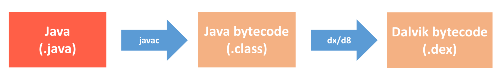
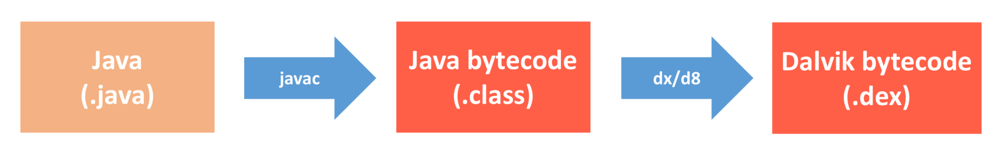

#### 编译插桩的应用场景
* **代码生成**。除了 Dagger、ButterKnife 这些常用的注解生成框架，Protocol Buffers、数据库 ORM 框架也都会在编译过程生成代码。代码生成隔离了复杂的内部实现，让开发更加简单高效，而且也减少了手工重复的劳动量，降低了出错的可能性。
* **代码监控**。除了网络监控和耗电监控，我们可以利用编译插桩技术实现各种各样的性能监控。为什么不直接在源码中实现监控功能呢？首先我们不一定有第三方 SDK 的源码，其次某些调用点可能会非常分散，例如想监控代码中所有 new Thread() 调用，通过源码的方式并不那么容易实现。
* **代码修改**。我们在这个场景拥有无限的发挥空间，例如某些第三方 SDK 库没有源码，我们可以给它内部的一个崩溃函数增加 try catch，或者说替换它的图片库等。我们也可以通过代码修改实现无痕埋点，就像网易的[HubbleData](https://neyoufan.github.io/2017/07/11/android/%E7%BD%91%E6%98%93HubbleData%E4%B9%8BAndroid%E6%97%A0%E5%9F%8B%E7%82%B9%E5%AE%9E%E8%B7%B5/)（无埋点技术）、51 信用卡的埋点实践
* **代码分析**。上一期我讲到持续集成，里面的自定义代码检查就可以使用编译插桩技术实现。例如检查代码中的 new Thread() 调用、检查代码中的一些敏感权限使用等。事实上，Findbugs 这些第三方的代码检查工具也同样使用的是编译插桩技术实现。
  
#### 技术上编译插桩是从代码编译的哪个流程介入的
  * **Java文件**。类似 APT、AndroidAnnotation 这些代码生成的场景，它们生成的都是 Java 文件，是在编译的最开始介入。
  * 
  * **字节码**（Bytecode）。对于代码监控、代码修改以及代码分析这三个场景，一般采用操作字节码的方式。可以操作“.class”的 Java 字节码，也可以操作“.dex”的 Dalvik 字节码，这取决于我们使用的插桩方法。
  * 
  * 字节码的方式功能更加强大，不过使用的复杂度也更大。